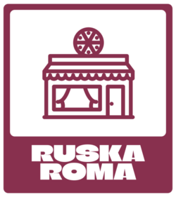

  

<h1 align="center">Pizzeria App</h1>

  <b>Aplicación para gestionar una pizzería, con un frontend en Kotlin y un backend en Java.</b>

  <i>Futuro: Integración con una base de datos y API REST para mejorar la gestión de pedidos y usuarios. </i>

---

## 🚀 Características

- **Frontend**: Interfaz intuitiva desarrollada en **Kotlin**.
- **Backend**: API REST en **Java** (próximamente con integración a base de datos).
  
## 📄 Documentación

- Consulta la documentación de JavaDoc para obtener detalles técnicos sobre la implementación: [JavaDoc](https://linktodocumentation)

## 📂 Proyectos Relacionados

- [Pizzeria-Backend](https://github.com/DaniAndries/Pizzeria-Backend.git): Repositorio del backend de la aplicación.

## 📜 Licencia

Este proyecto está licenciado bajo la [GNU General Public License](LICENSE).

## 👥 Autor

- **[Dani Andries](https://github.com/DaniAndries)**

---

  <i>¡Gracias por visitar este repositorio! Si tienes alguna sugerencia o mejora, no dudes en contribuir.</i>

