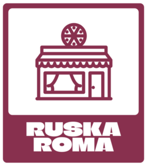

  

<h1 align="center">Pizzeria App</h1>

  <b>An application designed to manage a pizzeria, featuring a Kotlin-based frontend and a Java backend.</b>

  <i>Future Goals: Database integration and a REST API to enhance order and user management.</i>

---

## 🚀 Features

- **Frontend**: A user-friendly interface built with **Kotlin**.
- **Backend**: A REST API in **Java**, with future plans for database integration.

## 📄 Documentation

- Explore the technical implementation through the JavaDoc documentation: [JavaDoc](https://linktodocumentation)

## 📂 Related Projects

- [Pizzeria-Backend](https://github.com/DaniAndries/Pizzeria-Backend.git): Repository for the backend of this application.

## 📜 License

This project is licensed under the [GNU General Public License](LICENSE).

## 👥 Author

- **[Dani Andries](https://github.com/DaniAndries)**

---

  <i>Thank you for visiting this repository! If you have any suggestions or improvements, feel free to contribute.</i>

